<div align="center">

# Instituto Tecnológico Nacional de México

### Instituto Tecnológico de Oaxaca

**Carrera:** Ingeniería en Sistemas Computacionales <br><br><br><br>
**Materia:** Programación Web<br><br><br><br>
**Actividad:** Actividad 5 — Proyecto de Login <br><br><br><br>
**Docente:** Adelina Martínez Nieto<br><br><br><br>
**Integrantes:**
Gomez Roblero Angel Jahir
Enríquez Rodríguez Alejandro Guillermo<br><br><br><br>
**Fecha de entrega:** 08 de julio del 2026<br><br><br><br>

</div>

# Sistema de Acceso — Actividad 5

## Descripción del proyecto

Sistema de login simulado construido con **HTML5, CSS3 y JavaScript**, dividido en dos pantallas conectadas:

- **`login.html`**: formulario de acceso con validación de correo y contraseña (sin backend, validado 100% en JavaScript).
- **`index.html`**: pantalla del sistema ya "dentro", con sidebar, navbar y funcionalidad de captura de usuarios y alumnos.

El proyecto se dividió en dos partes de trabajo:

| Integrante | Parte del proyecto |
|---|---|
| Jahir Roblero | `index.html` — sidebar, submenú Usuarios/Captura, formulario de alumnos (número de control), modal de edad |
| Alejandro Guillermo Enríquez Rodríguez | `login.html` — formulario de acceso, validaciones, navbar con usuario y dropdown de cierre de sesión |


## Documentación técnica

### Framework CSS
El proyecto usa **CSS puro** (sin Bootstrap ni Tailwind), con estilos personalizados en `css/login.css` y `css/navbar.css`.

### Flujo del login hacia el sistema
1. El usuario llena los campos de **correo** y **contraseña** en `login.html`.
2. Al perder el foco (`blur`) de cada campo, se valida en tiempo real usando las funciones `validarCorreo()` y `validarPassword()` de `js/utileria.js`. Si el dato no es válido, se muestra un mensaje de error debajo del campo correspondiente.
3. Al dar clic en el botón **LOGIN**, se vuelven a validar ambos campos.
4. Si ambos son válidos, se muestra ("Inicio de sesión válido") y, después de un breve momento, la página redirige automáticamente a `index.html`.
5. Si `index.html` se abre directamente sin haber iniciado sesión (sin dato guardado), el sistema redirige de regreso a `login.html`.

### Cómo se pasa el usuario del login al navbar
Se usa **`sessionStorage`**, el almacenamiento temporal del navegador que dura mientras la pestaña esté abierta (se borra al cerrarla), simulando el comportamiento de una sesión real sin necesitar backend.

- En `login.js`, al validar el login correctamente, se guarda el correo con:
  ```javascript
  sessionStorage.setItem("usuarioActivo", usuario);
  ```
- En `index.html` (`navbar.js`), al cargar la página se lee ese valor con:
  ```javascript
  sessionStorage.getItem("usuarioActivo");
  ```
  y se muestra en el navbar, a la derecha.
- Al dar clic en **"Salir del sistema"**, se elimina el dato con `sessionStorage.removeItem("usuarioActivo")` y se redirige a `login.html`, simulando el cierre de sesión.

### Métodos principales

| Método | Ubicación | Función |
|---|---|---|
| `validarCorreo(valor)` | `js/utileria.js` | Valida formato de correo electrónico |
| `validarPassword(valor)` | `js/utileria.js` | Valida requisitos mínimos de la contraseña |
| Evento `blur` en campos | `js/login.js` | Muestra/oculta mensajes de error en tiempo real |
| Evento `click` en botón LOGIN | `js/login.js` | Valida ambos campos y controla la redirección |
| `sessionStorage.setItem()` | `js/login.js` | Guarda el usuario que inició sesión |
| `sessionStorage.getItem()` | `js/navbar.js` | Recupera el usuario para mostrarlo en el navbar |
| Dropdown de usuario (`click` + `classList.toggle`) | `js/navbar.js` | Abre/cierra el menú con la opción "Salir del sistema" |
| `sessionStorage.removeItem()` | `js/navbar.js` | Cierra la sesión y regresa a `login.html` |


---

## Estructura del proyecto

```
Actividad5/
├── login.html
├── index.html
├── README.md
├── css/
│   ├── login.css
│   └── navbar.css
├── js/
│   ├── login.js
│   ├── navbar.js
│   └── utileria.js
└── img/
    ├── user-login.svg
    └── screenshots/        
```

---

## Proceso de creación

### 1. Login (login.html, login.css, login.js)
- Se creó el formulario base con campos de correo y contraseña, usando las funciones de validación de `utileria.js`.
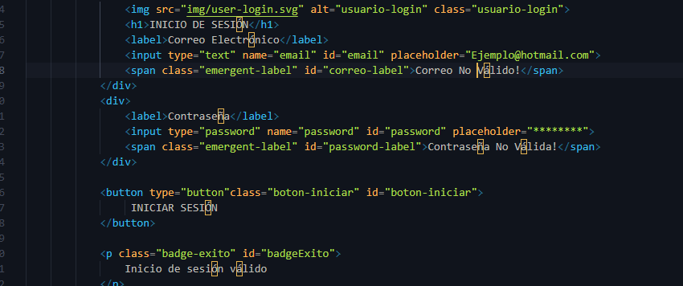

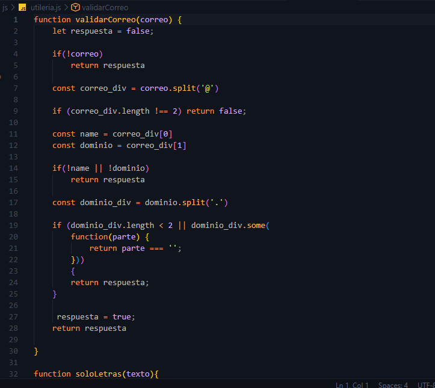

- Se agregaron mensajes de error dinámicos (`emergent-label`) que aparecen/desaparecen según la validación.
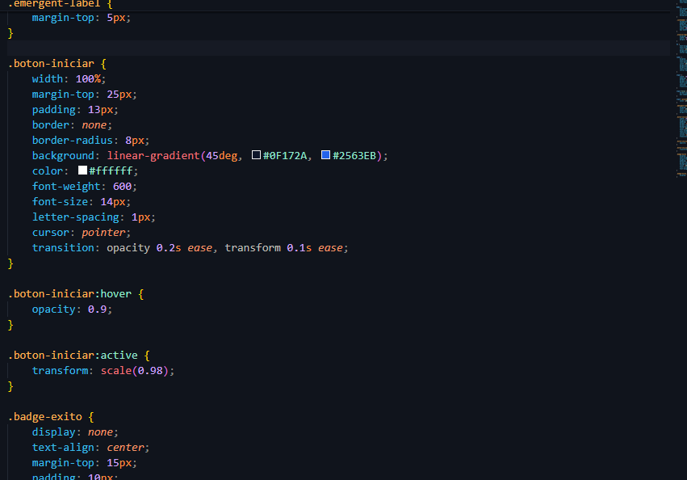

- Se diseñó la tarjeta de login con un gradiente (`#0F172A → #2563EB → #38BDF8`) para mantener consistencia visual con el resto del sistema, sombra, bordes redondeados y estados de `focus` en los inputs.

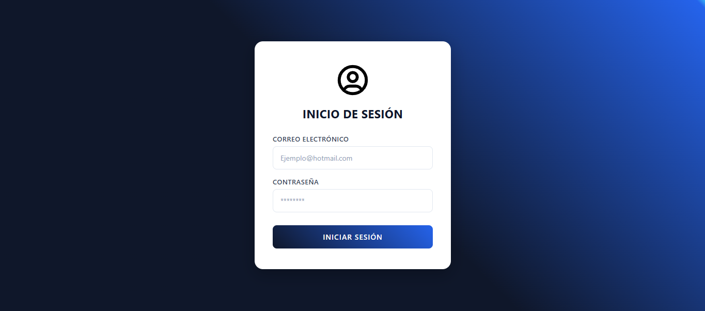


### 2. Conexión login → sessionStorage
- Se agregó el guardado del usuario en `sessionStorage` justo antes de la redirección a `index.html`.

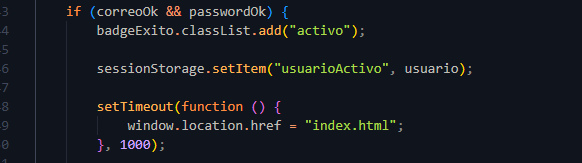

### 3. Navbar (dentro de index.html)


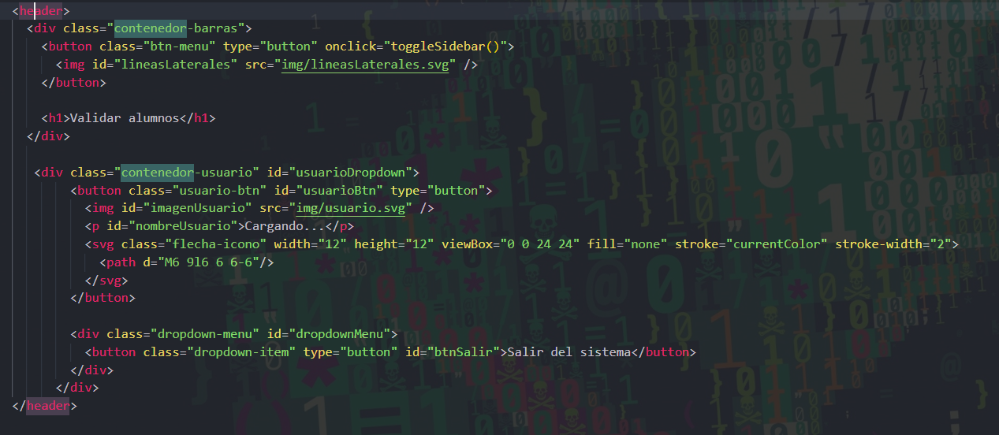
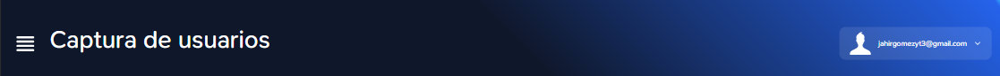

### 4. Sidebar y submenú Usuarios/Captura


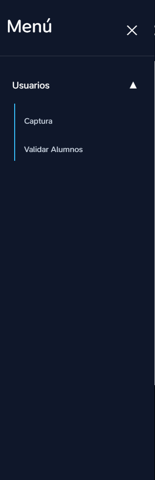

### 5. Formulario de alumnos y número de control

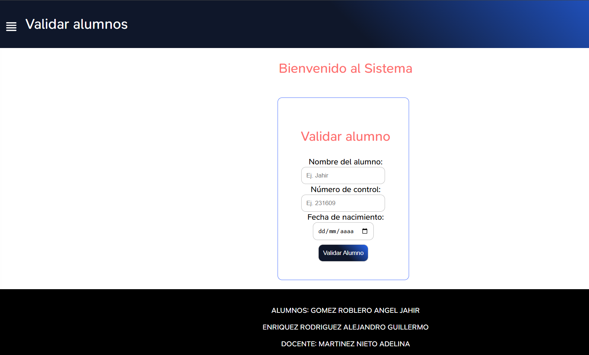


## Capturas de pantalla — Flujo completo

### 1. Login
Pantalla de acceso con validación de correo y contraseña.


### 2. Login exitoso
Mensaje de confirmación antes de redirigir al sistema.
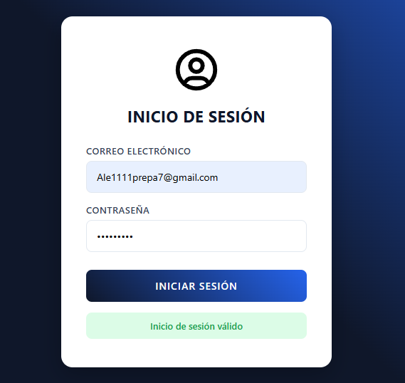

### 3. Sistema (index.html)
Vista del sistema ya dentro, con sidebar y navbar mostrando el usuario.
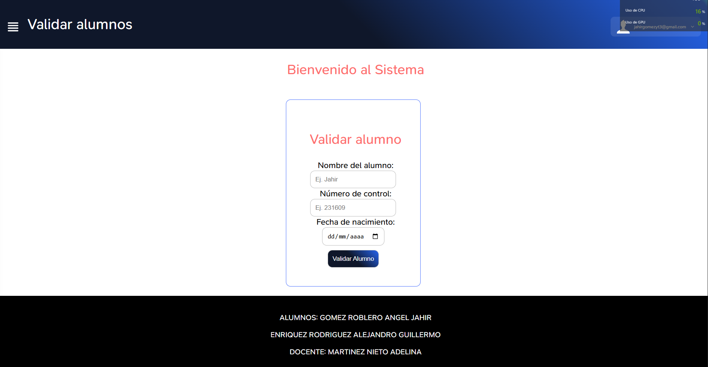


### 4. Submenú Usuarios 
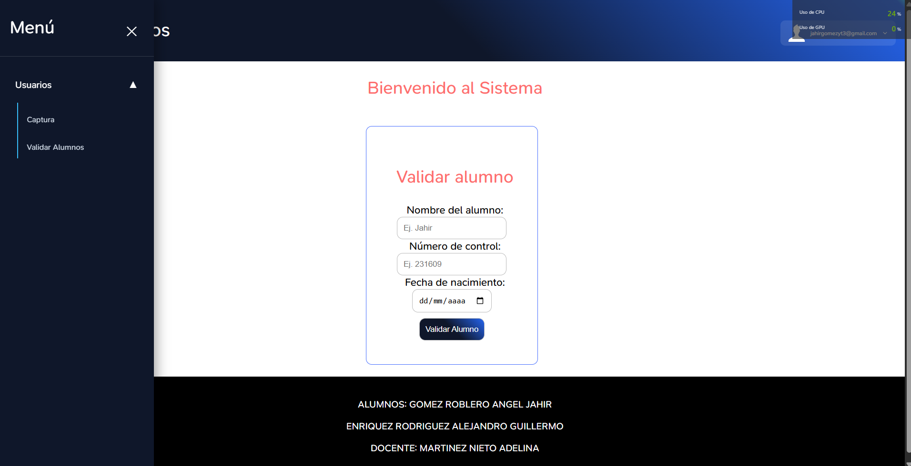

### 5. Formulario de alumnos y modal de edad
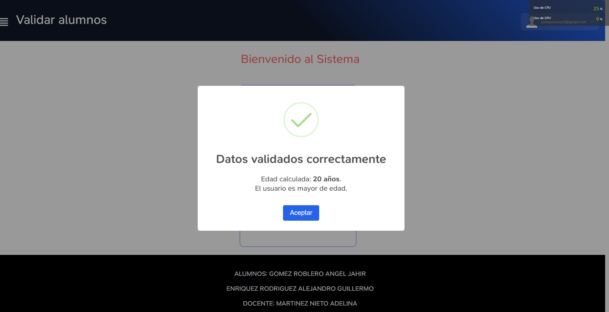


### 6. Cierre de sesión
Dropdown del navbar mostrando la opción "Salir del sistema" y regreso a login.html.
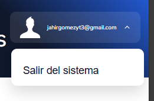


## Tecnologías utilizadas

- **HTML5** — estructura de ambas pantallas
- **CSS3** — estilos personalizados (sin framework)
- **JavaScript** — validaciones (`utileria.js`), manejo de sesión (`sessionStorage`) y control de interfaz (dropdown, sidebar, modal)


## Ver en vivo

🔗 **GitHub Pages:** https://jahirroblero.github.io/Actividad5/

🔗 **Repositorio:** https://github.com/JahirRoblero/Actividad5


## Autores

**Jahir Roblero** — Sidebar, submenú Usuarios/Captura, formulario de alumnos, modal de edad
**Alejandro Guillermo Enríquez Rodríguez** — Login, validaciones, navbar con usuario y cierre de sesión

Estudiantes de Ingeniería en Sistemas Computacionales — Instituto Tecnológico de Oaxaca